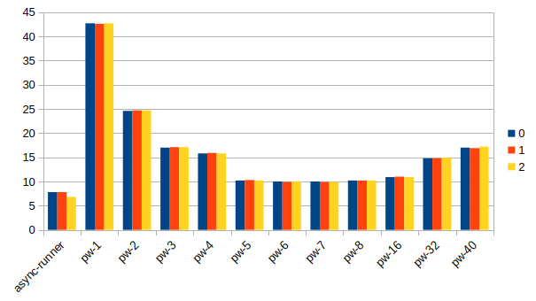
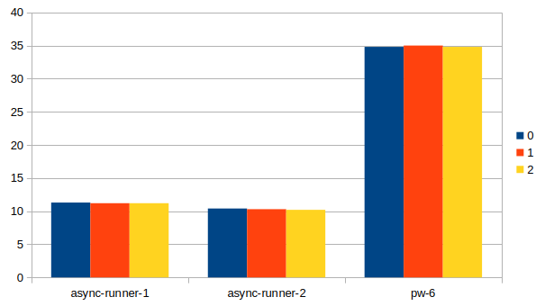
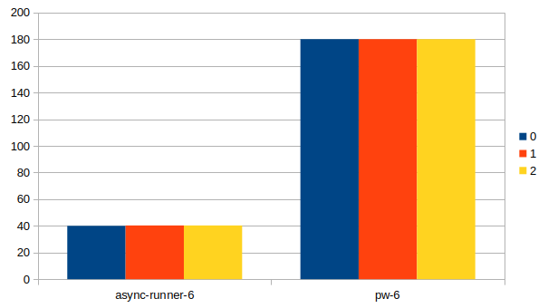

# Playwright Async Benchmark 

## The Project
The tests run on a simple express server located in `src/server`. It does some fake async work to imitate a real server.

Each test is ran 5 times (in every benchmark), just so I wouldn't need to be creative and write a lot of tests. (can be
changed via the `TEST_MULTIPLIER` environment variable)

## Results
on my machine, an Ubuntu with the specs:
```
OS: Ubuntu 24.04.3 LTS x86_64
Host: 20L6S0CG09 ThinkPad T480
Kernel: 6.14.0-28-generic
Uptime: 56 mins
Packages: 2481 (dpkg), 17 (flatpak), 20 (snap)
Shell: bash 5.2.21
Resolution: 1920x1080
DE: GNOME 46.0
WM: Mutter
WM Theme: Adwaita
Theme: Yaru-sage-dark [GTK2/3]
Icons: Yaru-sage [GTK2/3]
Terminal: zellij
CPU: Intel i5-8350U (8) @ 3.600GHz
GPU: Intel UHD Graphics 620
Memory: 2988MiB / 39991MiB
```
For context.

To run the benchmarks yourself run `./run-all-benchmarks.sh`.
It will write in the relevant files the raw output from playwright.

### Test Runners
located in `src/test-runners` \
`pw.spec.ts` - The regular PlayWright interface. \
`async-runner.spec.ts` - For running tests concurrently in each worker \
`async-runner-with-plimit.spec.ts` - Same as `async-runner.spec.ts` but creates a cap for concurrency.

### Kinds of Benchmarks
- `run-all.sh` \
  sets `TEST_MULTIPLIER=5`, total of 40 tests\
  runs `async-runner.spec.ts` with one worker, \
  and `pw.spec.ts` with all of 1, 2, 3, 4, 5, 6, 7, 8, 16, 32, 40 workers. \
  It stops at `40` as there are a total of `40` tests.
- `run-best.sh` \
  sets `TEST_MULTIPLIER=20`, total of 160 tests\
  runs `async-runner.spec.ts` once with one worker, and then with 2 workers, \
  and `pw.spec.ts` with 6 workers as it's seems to do the best on my machine.
- `run-fair.sh` \
  sets `TEST_MULTIPLIER=120`, total of 960 tests\
  runs `async-runner-with-plimit.spec.ts` once with 6 workers, \
  and `pw.spec.ts` with 6 workers as well.

### Graphs
On my Ubuntu: \
 \
You can see that not only that the async-runner (that runs with 1 worker) is much faster then the best PW has to offer.\
There is also a regression when you try to run more workers then your threads on your CPU (as expected)

But this doesn't do much for me, So I run it with a multiplier of 20 (instead of 5), totaling in 160 tests. \
And as it seems that the best workers number on my machine is 6, I stuck with it. \
This is what the script `run-best.sh` is for. Notice that the difference between the 2 asyncs here is that 1 runs with 2 workers \
 \
You can see that even with 1 worker we gained 300% increase.

I hear what you are saying, this isn't really fair right? I mean, one benchmark gets 6 workers and the other only 1? \
So I made another benchmark called `run-fair.sh`, which runs the `async-runner` with 6 workers as well, and with much
more tests. \
The problem with this is that sometimes the event-loop doesn't get to all of the tests on time, and we get errors cause
by the time we check that the button have the label `Loading...` it is already `Ok`. \
How can we solve it? With the library [p-limit](https://www.npmjs.com/package/p-limit).\
By letting each worker have a concurrency of `15`, we assure all of our tests get the attention they need.\
We get these results: \
 \
Now we can see that we can achieve an increase in speed of `4.5` times that of PlayWright.


## What Now?
This gain can only be if the tests are waiting for things to happen, and not doing the hard computation on their own. \
As this is the case of most website's tests I believe it should be a feature in PlayWright, to make it easier for the developers to gain this performance. \
As I said in my [first issue](https://github.com/microsoft/playwright/issues/36900), this should not be the default
behaviour of PlayWright. \
But it can be configurable in `playwright.config.ts` for example, maybe even use something like `p-limit` and allow to
limit the amount of concurrency per worker (like in `run-fair.sh`) Just a thought.

## Disadvenatges
As the advenatges are clear, the disadvantages need to be stated
- **Encapsulation** \
  As we can create new browser context for each test via `await browser.newContext()`, \
  and catch errors from functions natively in JS. \
  The real encapsulation problem comes from tests writing and reading global variables, which can cause flaky tests. \
  This is the main reason why I believe this should not be the default behaviour of PW.

- **Refactor** \
  To be honest, I didn't read that much into the PW code, but I believe it wouldn't be that trivial of a PR.

  
